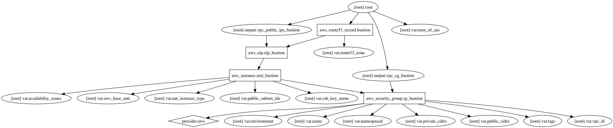

Bastion host in VPC Terraform Module
=====================

Usage:
------

    module "bastion" {
      source              = "../tf_bastion"
      environment         = "${var.environment}"
      name                = "${var.name}"
      aws_base_ami        = "ami-9be6f38c" # "Amazon Linux AMI" # 2016.09.1 (HVM)
      availability_zones  = "${module.vpc.availability_zones}"
      # Whitelist Internal (Routing, SG)
      private_cidrs       = ["${var.corp_vpn_cidr}"]
      # Roku public cidrs - Whitelist External (SG)
      public_cidrs        = []
      public_subnet_ids   = "${module.vpc.external_subnets}"
      route53_zone        = "${module.dns_public.route53_zone_id}"
      ssh_key_name        = "${var.ssh_key_name}"
      vpc_id              = "${module.vpc.id}"
    }

## Inputs

| Name | Description | Default | Required |
|------|-------------|:-----:|:-----:|
| availability_zones |  | - | yes |
| aws_base_ami | Amazon Linux AMI | - | yes |
| environment | Environment (ex: dev, qa, stage, prod) | - | yes |
| name | Name | - | yes |
| namespaced | Namespace all resources (prefixed with the environment)? | `true` | no |
| nat_instance_type | NAT/bastion instance type | `t2.micro` | no |
| num_of_azs | Number of multipe AZ to be utilized | `2` | no |
| private_cidrs | Internal CIDRs - range of private CIDRs that can connect to resources inside the VPC | `<list>` | no |
| public_cidrs | Trusted CIDRs - range of public Internet CIDRs that can connect to the public resources of the VPC | - | yes |
| public_subnet_ids | Public subnets list | - | yes |
| route53_zone | Route53 Zone ID to add Bastion DNS to | - | yes |
| ssh_key_name | SSH key pair name in AWS (must already exist) | `channelstore-nonprod` | no |
| tags | A map of tags to add to all resources | `<map>` | no |
| vpc_id | AWS VPC ID to put bastion in | - | yes |

## Outputs

| Name | Description |
|------|-------------|
| vpc_public_ips_bastion | Bastion hosts public IPs |
| vpc_sg_bastion | Bastion host security group |

### Resource Graph

